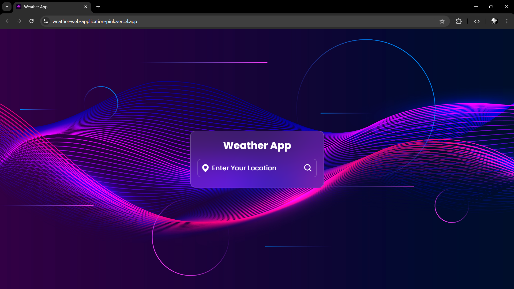
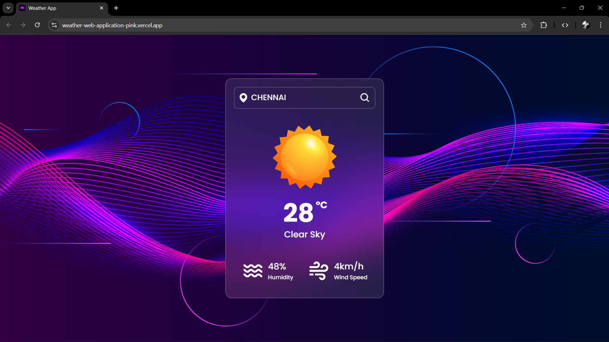
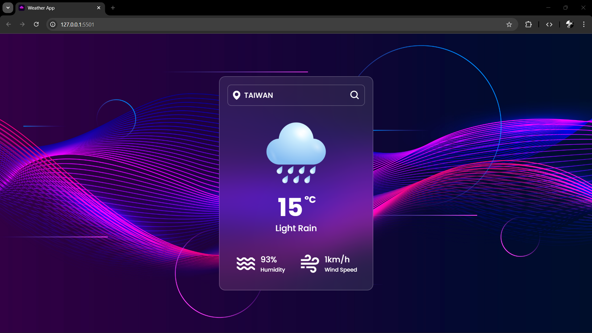
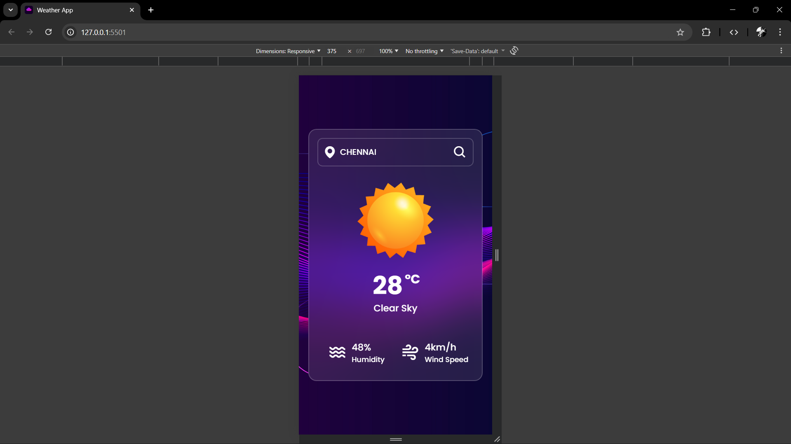

# 🌦️ Weather App – Real Time Weather Application

A **Modern Weather Application** built using **HTML5, CSS3, and JavaScript** that fetches real-time weather data from an external API. This project demonstrates **API integration, responsive design, and smooth UI animations**, making it a great project for showcasing front-end development skills.

---

## 🚀 Features

- 🔍 **City Search:** Users can enter any city to check the weather
- 🌡️ **Real-Time Weather Data:** Fetches live weather information using API
- ☁️ **Dynamic Weather Icons:** Displays weather condition images like rain, clouds, mist, etc.
- 💧 **Humidity Information:** Shows current humidity percentage
- 🌬️ **Wind Speed Display:** Shows wind speed in km/h
- ⚠️ **Error Handling:** Displays a message when the city is not found
- ✨ **Smooth UI Animations:** Weather details animate when data loads
- 📱 **Responsive Design:** Works across laptop, tablet, and mobile screens

---

## 🧰 Technologies Used

- **HTML5** – Structure and semantic markup  
- **CSS3** – Styling, animations, and layout  
- **JavaScript (ES6)** – API integration and DOM manipulation  
- **OpenWeatherMap API** – Fetching real-time weather data  
- **Boxicons** – Icons used in the UI
  
---

## 🌐 Live Demo

👉 https://weather-web-application-pink.vercel.app/

---

## 📸 Preview






---

## ⚙️ How It Works

1. User enters a **city name** in the search box.
2. JavaScript sends a request to the **OpenWeatherMap API**.
3. The API returns weather data including:
   - Temperature
   - Weather description
   - Humidity
   - Wind speed
4. The application dynamically updates the UI with the fetched data.

---

## 🔑 API Used

This project uses the **OpenWeatherMap API**.

Example API Request:

```
https://api.openweathermap.org/data/2.5/weather?q=city&units=metric&appid=YOUR_API_KEY
```

---

## 🎯 Learning Highlights

This project helped practice:

- Fetch API in JavaScript
- Handling JSON data
- DOM manipulation
- CSS animations
- Responsive design with media queries
- Error handling for API responses
  
---

## 👨‍💻 Author

**Gowtham Sundaram**

Aspiring **Fullstack Developer** passionate about building interactive web applications and modern UI dashboards.

---
